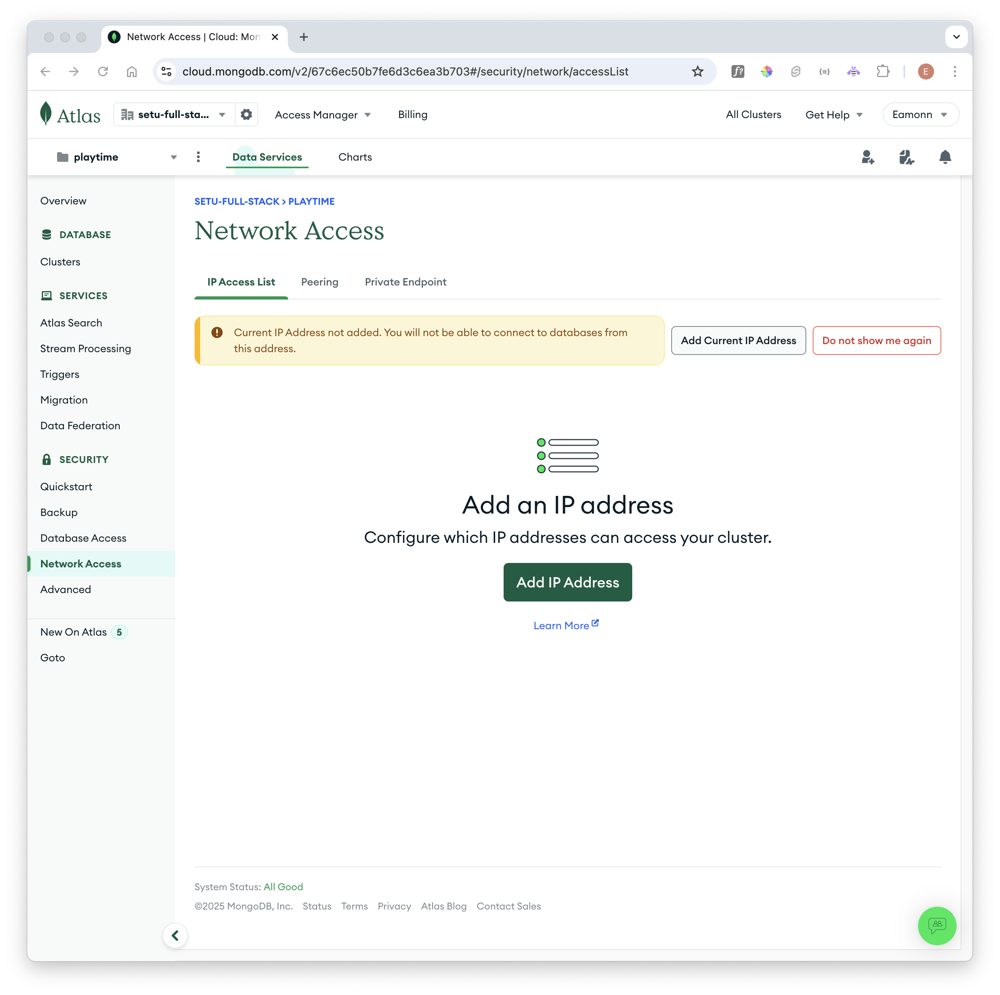
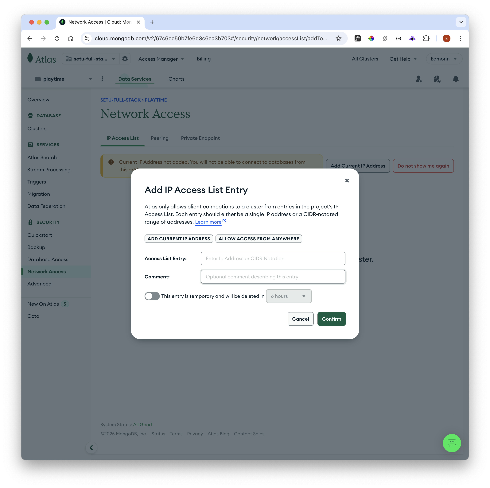
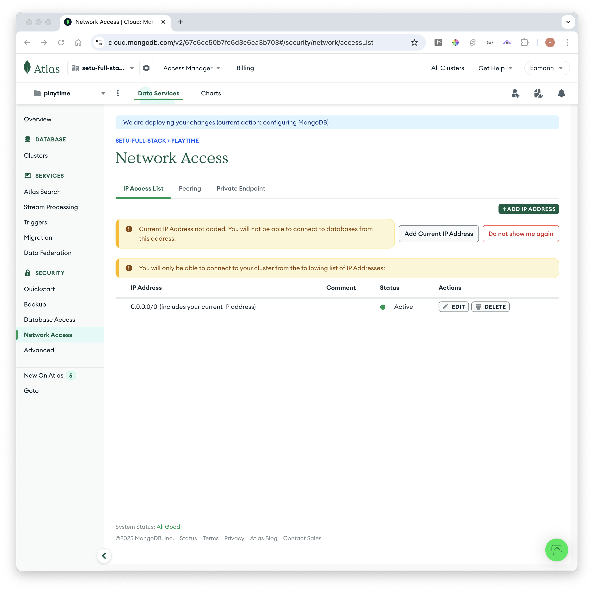
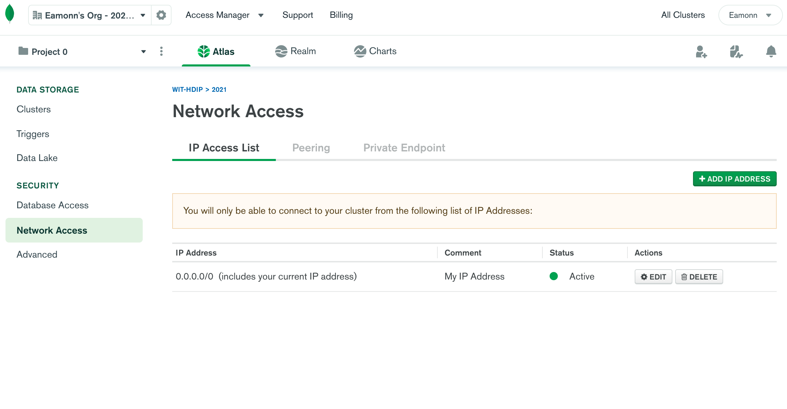

# Enable Access

For the project you have created, select the `Network access` tab:

Select Add IP Address:

And select `Allow Access from Anywhere`, press `Confirm` - and your cluster will be reconfigured:

Eventually it will be redeployed:

