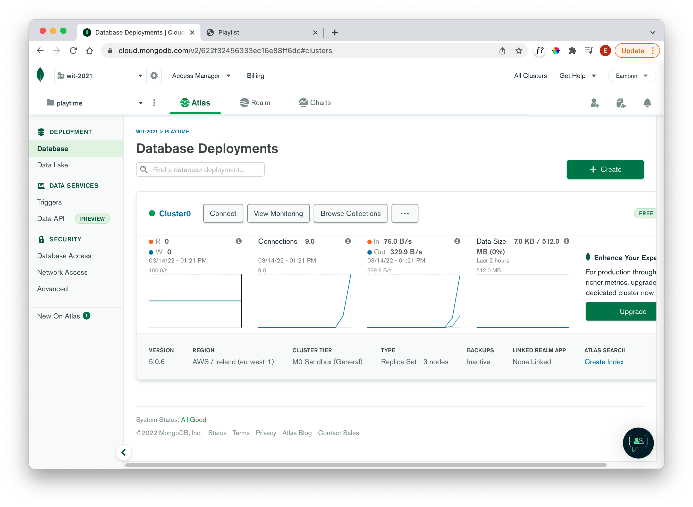

# Exercises

### Exercise 1

If you are seeding the database, then you should be able to log in to the running app now as one of the test users, exploring the associated playlists/tracks

### Exercise 2

Explore the test data from the Cloud Atlas console via the **Browse Collections** panel:

Be careful with the unit tests - running the tests a few times seems to be ok, but you may need to make sure they are not running continuously (for instance in a debug session). The frequency of calls to the DB may trigger an alarm, resulting in your IP being blocked for a period.