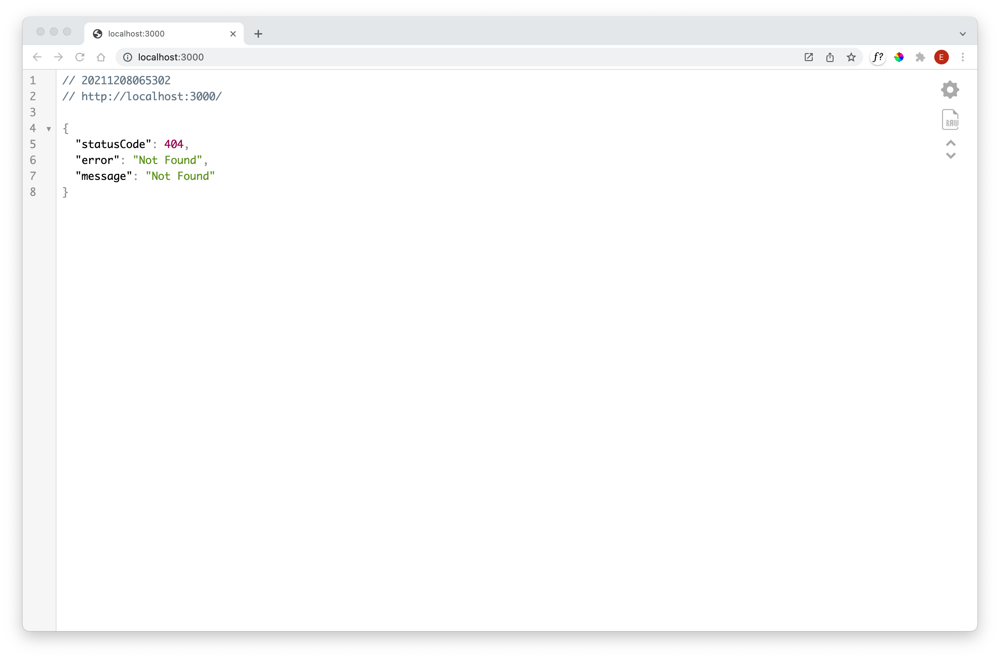

# Server

With this code quality enforcement in place, we can now start to build the application. If we stray outside the ESLint/Prettier settings we will expect our IDE to alert us in the editor and/or automatically autocorrect.

Install the following component in our application by running this command (inside the project folder):

~~~bash
npm install @hapi/hapi
~~~

Now create a folder `src` in your project, and introduce the following module:

## src/server.js

~~~javascript
import Hapi from "@hapi/hapi";
import path from "path";

import { fileURLToPath } from "url";

const __filename = fileURLToPath(import.meta.url);
const __dirname = path.dirname(__filename);

async function init() {
  const server = Hapi.server({
    port: 3000,
    host: "localhost",
  });
  await server.start();
  console.log("Server running on %s", server.info.uri);
}

process.on("unhandledRejection", (err) => {
  console.log(err);
  process.exit(1);
});

init();
~~~

Change `package.json` to:

## package.json

~~~json
{
  "name": "playtime",
  "version": "1.0.0",
  "description": "",
  "license": "ISC",
  "author": "",
  "type": "module",
  "main": "src/server.js",
  "scripts": {
   "start": "node src/server.js",
    "lint": "./node_modules/.bin/eslint . --ext .js"
  },
  "devDependencies": {
    "eslint": "^8.57.1",
    "eslint-config-airbnb-base": "^15.0.0",
    "eslint-config-prettier": "^10.0.1",
    "eslint-plugin-import": "^2.31.0",
    "prettier": "^3.4.2"
  },
  "dependencies": {
    "@hapi/hapi": "^21.3.12"
  }
}
~~~

In the above, the main path has been changed:

~~~json
  "main": "src/server.js",
~~~

... and the following further adjustments have been made:

~~~json
  "type": "module",
  "scripts": {
    "start": "node src/server.js",
    "lint": "./node_modules/.bin/eslint . --ext .js"
  },
~~~

## Run

To run the application, enter the following command:

~~~bash
npm run start
~~~

~~~bash

> playtime@0.1.0 start
> node src/server.js

Server running on http://localhost:3000
~~~

Browsing to the app we should see:

In the above, we are using a Chrome plugin called `JSONViewer` - which will display JSON responses formatted as above. It will not be invoked if the responses are HTML.

- [JSONViewer](https://chrome.google.com/webstore/detail/json-viewer/gbmdgpbipfallnflgajpaliibnhdgobh)

