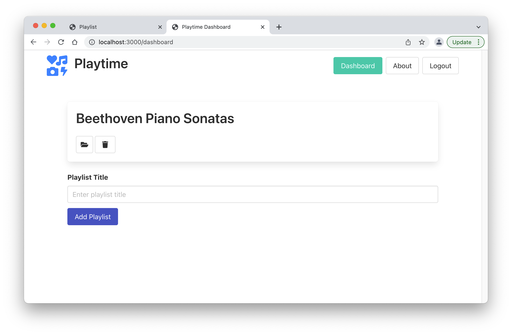

# Exercises

This is the Playtime application at the end if this lab:

- [playtime-0.2.0](https://github.com/wit-hdip-comp-sci-2024/full-stack-1/tree/main/prj/playtime/playtime-0.2.0)

## Exercise 1

Introduce a delete playlist feature:

### Exercise 2

Introduce a delete track feature:

## Exercise 3

Currently the cookie name + password are embedded in server.js:

~~~javascript
    cookie: {
      name: "playtime",
      password: "secretpasswordnotrevealedtoanyone",
      isSecure: false,
    },
~~~

In general we should attempt to "externalise" sensitive information, secrets or API details to a text file. This is usually called `.env`

## .env

~~~bash
cookie_name=playlist
cookie_password=secretpasswordnotrevealedtoanyone
~~~

This module here can help load this information:

- <https://github.com/motdotla/dotenv#readme>

See if you can integrate this into your app, replacing the hard coded strings in server.js

## Exercise 4

What happens when a user logs out? The cookie should be deleted. Implement cookie deletion in the logout action.