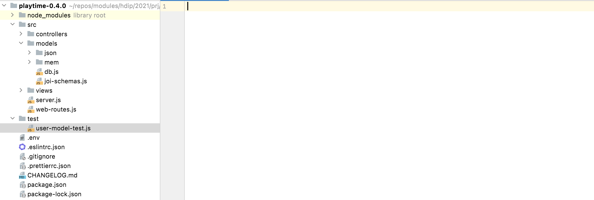

# TDD Components

We are going to use two supporting components to allow us to run unit tests:

- <https://mochajs.org/>
- https://www.chaijs.com/

These provide a components for running tests in a convenient manner + a library for composing test assertions.

On **Mac/Linux,** we can install these as developer dependencies:

~~~bash
npm install -D mocha
npm install -D chai
~~~

These are "developer" dependencies, which appear alongside the others in this category in `package.json`:

~~~javascript
  "devDependencies": {
    "eslint": "^8.56.0",
    "eslint-config-airbnb-base": "^15.0.0",
    "eslint-config-prettier": "^9.1.0",
    "eslint-plugin-import": "^2.29.1",
    "prettier": "^3.2.4",
    "chai": "^5.0.0",
    "mocha": "^10.2.0"
  }
~~~

On **Windows,** we need to install as global for the moment:

~~~
npm install -g mocha
npm install -g chai
~~~

The convention is to compose tests in a `test` folder, a peer of the `src` folder. Create this folder now and create your first test:

- user-model-test.js

## user-model-test.js

~~~javascript
import { assert } from "chai";
import { db } from "../src/models/db.js";

suite("User API tests", () => {

  const maggie = {
    firstName: "Maggie",
    lastName: "Simpson",
    email: "maggie@simpson.com",
    password: "secret",
  };

  setup(async () => {
    db.init();
  });

  test("create a user", async () => {
    const newUser = await db.userStore.addUser(maggie);
    assert.deepEqual(maggie, newUser)
  });
});
~~~

Another eslint violation, this time an objection to chai being installed as a developer dependency. We will overrule this in "eslintrc.json":

~~~
    "import/no-extraneous-dependencies": "off"
~~~

To run the tests, introduce an additional script into `package.json` called test:

### package.json (Mac/Linux)

~~~javascript
  "scripts": {
    "start": "node src/server.js",
    "lint": "./node_modules/.bin/eslint . --ext .js",
    "test": "./node_modules/mocha/bin/_mocha --ui tdd test/**.js -exit"
  }
~~~

### package.json (Windows)

~~~javascript
  "scripts": {
    "start": "node src/server.js",
    "lint": "eslint . --ext .js",
    "test": "mocha --ui tdd test/**.js -exit"
  }
~~~

We can run the test from the shell:

~~~bash
npm run test
~~~

This test should pass:

~~~bash
> playtime@0.4.0 test
> ./node_modules/mocha/bin/mocha --ui tdd test/**.js

  User API tests
    ✔ create a user

  1 passing (4ms)
~~~

To see what an error looks like, add the following to the test function:

~~~javascript
    assert.equal(1, 2)
~~~

Run the test again - this time a failure will be reported:

~~~bash
 User API tests
    1) create a user

  0 passing (4ms)
  1 failing

  1) User API tests
       create a user:

      AssertionError: expected 1 to equal 2
      + expected - actual

      -1
      +2
~~~
The second test failed because of the deliberate introduction of a false assertion ('assert.equal(1,2)'), designed to demonstrate what a test failure looks like. You can delete the assert.equal(1,2). 

