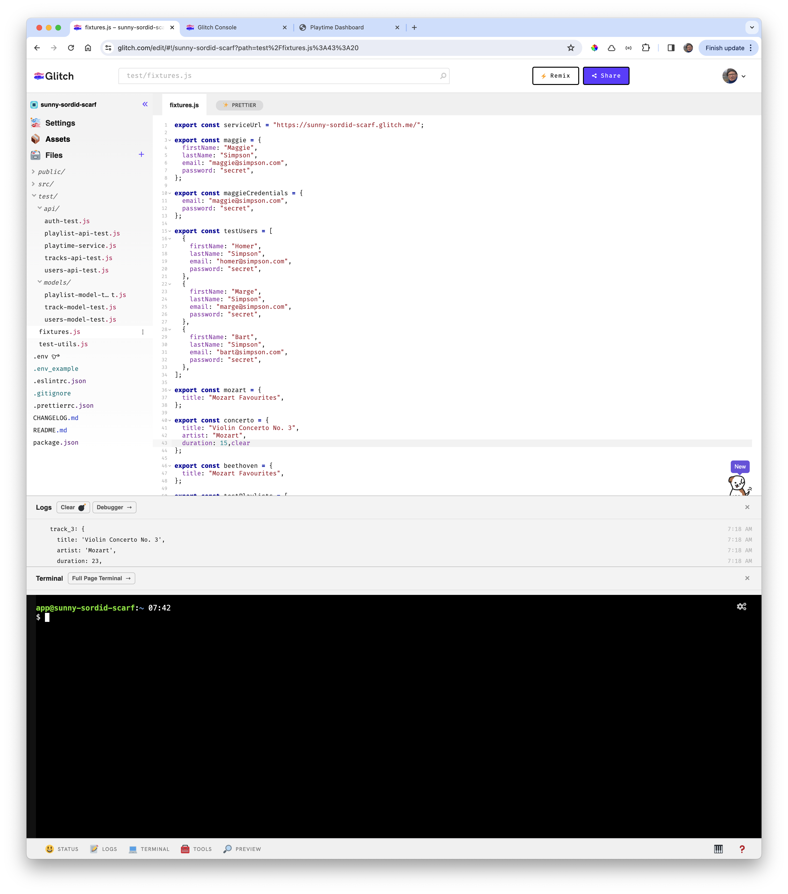
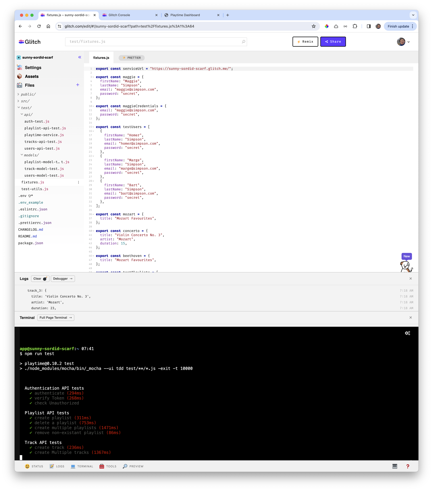

# Test

Glitch has a terminal which will enable us to run our tests:

Before entering the run command - edit the fixtures.js to include the url of the deployed application (see above). Then, in the terminal enter:

~~~bash
npm run test
~~~

Be careful not to overuse this feature - as we do not want to issue an overwhelming number of mongo db requests, which may trigger a temporary block on our IP with the service.
