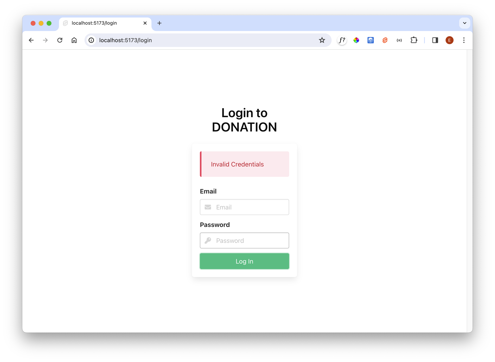

# Login

We need some form components for Login + Signup. First, some more components

### lib/ui/UserCredentials.svelte

~~~html

  <label class="label" for="email">Email</label>
  

    <input
      id="email"
      bind:value={email}
      class="input"
      type="text"
      placeholder="Email"
      name="email"
    />
    
      <i class="fa fa-envelope"></i>
    
  

  <label class="label" for="password">Password</label>
  

    <input
      id="password"
      bind:value={password}
      class="input"
      type="password"
      placeholder="Password"
      name="password"
    />
    
      <i class="fa fa-key"></i>
    
  

~~~

### lib/ui/UserDetails.svelte

~~~html

<label class="label" for="firstName">Name</label>

  

    

      

        <input
          bind:value={firstName}
          class="input"
          type="text"
          placeholder="First Name"
          name="firstName"
        />
        
          <i class="fa fa-id-card"></i>
        
      

    

    

      

        <input
          bind:value={lastName}
          class="input"
          type="text"
          placeholder="Last Name"
          name="lastName"
        />
        
          <i class="fa fa-id-card"></i>
        
      

    

  

~~~

### lib/ui/Message.svelte

~~~html

<article class="message is-danger">
  

    {message}
  

</article>
~~~

We can use the components in the routes. First bring in a form for logging in:

### src/routes/login/LoginForm.svelte

~~~html

  {#if message}
    <Message {message} />
  {/if}
  <UserCredentials bind:email bind:password />
  <button onclick={() => login()} class="button">Log In</button>

~~~

Now use these components in the login route:

### src/routes/login/+page.svelte

~~~html

<section class="hero is-fullheight">
  

    

      

        <h3 class="title has-text-black has-text-centered">Login to DONATION</h3>
        <LoginForm />
      

    

  

</section>
~~~

The Login button from the home page should look like this:

At the moment any attempt to log in will fail:

