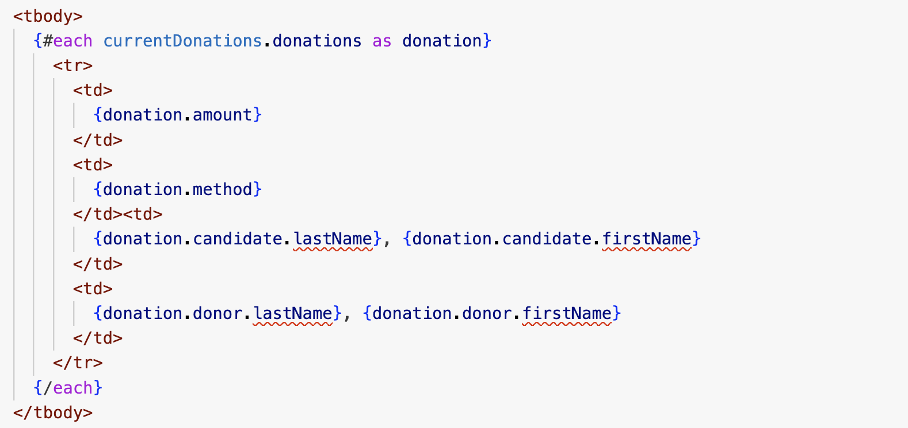

# Donation Type

Before getting on the the candidates donations page, we will do some housekeeping on the type system.

This is our current Donation type:

### lib/types/donation-types.ts

~~~typescript
export interface Donation {
  amount: number;
  method: string;
  candidate: Candidate | string;
  donor: User | string;
  lat: number;
  lng: number;
}
~~~

Note that candidate and donor have what are called "union" types:

~~~typescript
  candidate: Candidate | string;
  donor: User | string;
~~~

That is, a candidate for instance, can be either a string OR a Candidate object. We choose this because sometimes we would like the Candidate ID to be in this field (for instance when we are creating a Donation). At other times we may prefer to have a full Candidate object here (for instance when we are retrieving a list of all donations).

Union types can be convenient in contexts like this. However, they can cause typescript warnings in our components. For instance in DonationList in the VSCode we may see something like this:

We will fix this now by modifying the component like this:

~~~html
  <tbody>
    {#each currentDonations.donations as donation}
      <tr>
        <td>
          {donation.amount}
        </td>
        <td>
          {donation.method}
        </td>
        <td>
          {#if typeof donation.candidate !== "string"}
            {donation.candidate.lastName}, {donation.candidate.firstName}
          {/if}
        </td>
        <td>
          {#if typeof donation.donor !== "string"}
            {donation.donor.lastName}, {donation.donor.firstName}
          {/if}
        </td>
      </tr>
    {/each}
  </tbody>
~~~

The above introduces an if statement - which will only attempt to display the candidate/donation objects if they are in fact full Candidate/Donation types. This will eliminate the type error 'squiggles'.
