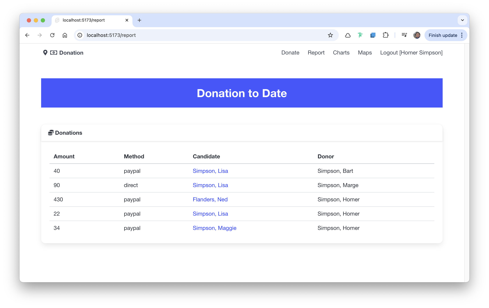
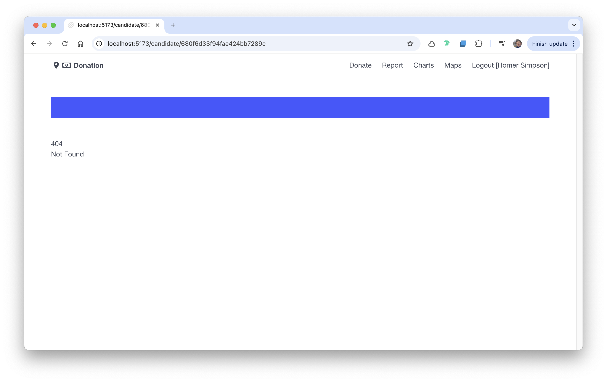

# Revised Donation List 

Our current DonationList component looks like this:

This is the component:

### lib/ui/DonationList.svelte

~~~html

<table class="table is-fullwidth">
  <thead>
    <tr>
      <th>Amount</th>
      <th>Method</th>
      <th>Candidate</th>
      <th>Donor</th>
    </tr>
  </thead>
  <tbody>
    {#each currentDonations.donations as donation}
      <tr>
        <td>
          {donation.amount}
        </td>
        <td>
          {donation.method}
        </td>
        <td>
          {#if typeof donation.candidate !== "string"}
            {donation.candidate.lastName}, {donation.candidate.firstName}
          {/if}
        </td>
        <td>
          {#if typeof donation.donor !== "string"}
            {donation.donor.lastName}, {donation.donor.firstName}
          {/if}
        </td>
      </tr>
    {/each}
  </tbody>
</table>
~~~

We would like to turn each candidate name in the table into a link, which should include the ID of the candidate:

~~~html
...
        <td>
          {#if typeof donation.candidate !== "string"}
            <a href={`/candidate/${donation.candidate._id}`}>{donation.candidate.lastName}, {donation.candidate.firstName}</a>
          {/if}
        </td>
...
~~~

This will render like this:

Clicking on any of the links gives a 404:

Notice the route:

~~~
http://localhost:5173/candidate/680f6d33f94fae424bb7289c
~~~

It contains the ID of the candidate - different for each candidate of course.
