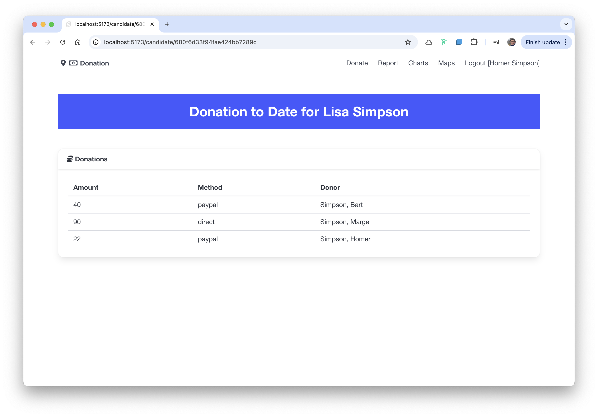

# Candidates route

We would like a route that will be parameterised with a candidate Id. This is implemented in SvelteKit by creating a route with the folder name containing a variable element name, enclosed in square brackets:

### routes/candidates/[id]/+page.server.ts

~~~typescript
import { donationService } from "$lib/services/donation-service";
import type { PageServerLoad } from "./$types";

export const load: PageServerLoad = async ({ params }) => {
  const candidates = await donationService.getCandidates();
  const candidate = candidates.find((c) => c._id === params.id);
  return {
    candidate,
    donations: await donationService.getDonations(params.id)
  };
};
~~~

The above recovers the id from params, and uses the id to retrieve the donations (assuming the id is for the candidate we are inspecting). We also return the full matching candidate object.

The matching +page.svelte can then make use of these objects:

### routes/candidates/[id]/+page.svelte

~~~html

<Card title="Donations">
  <CandidateDonations donations={data.donations} />
</Card>
~~~

This is using this new UI component:

### lib/ui/CandidateDonations.svelte

~~~html

<table class="table is-fullwidth">
  <thead>
    <tr>
      <th>Amount</th>
      <th>Method</th>
      <th>Donor</th>
    </tr>
  </thead>
  <tbody>
    {#each donations as donation}
      <tr>
        <td>
          {donation.amount}
        </td>
        <td>
          {donation.method}
        </td>
        <td>
          {#if typeof donation.donor !== "string"}
            {donation.donor.lastName}, {donation.donor.firstName}
          {/if}
        </td>
      </tr>
    {/each}
  </tbody>
</table>
~~~

When selecting candidate from the report view:

Then we should now see a list of the donations for each candidate in a separate page:

